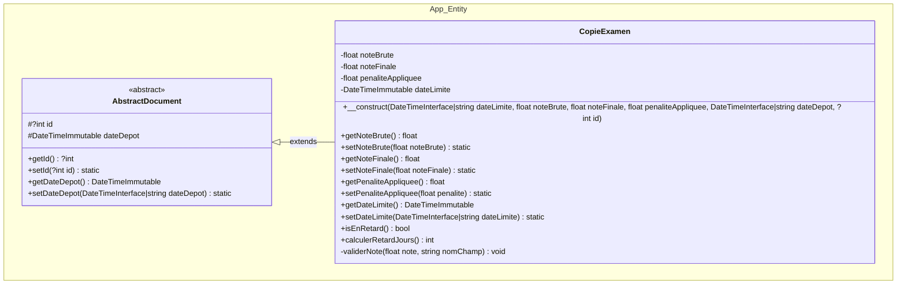

# Système de Notation Universitaire (PHP 8 / PostgreSQL / POO)

Application d'automatisation du traitement des copies d'examen, du contrôle de validité des données et du calcul dynamique des pénalités de retard selon les règlements universitaires.

---

# Partie 0 — Fondamentaux Git & Gestion du Projet

## 1. Pourquoi `vendor/` ne doit pas être versionné ?
Le dossier `vendor/` contient l'ensemble des bibliothèques tierces et fichiers générés automatiquement par Composer. Il peut être très volumineux et être recréé à l'identique à tout moment via la commande `composer install`. On versionne uniquement `composer.json` (déclaration des dépendances) et `composer.lock` (verrouillage des versions exactes).

## 2. Commit vs Tag
- Un **commit** enregistre un ensemble de modifications précises à un instant $T$ dans l'historique d'une branche.
- Un **tag** (étiquette) est un pointeur immuable sur un commit spécifique marquant un jalon important ou une version publiable (ex: `v0.1.0`, `v0.2.0`, `v0.3.0`).

## 3. Pourquoi `main` doit rester stable ?
La branche `main` représente le code de production validé et directement déployable. Tous les développements s'effectuent sur des branches isolées (`partie/01-initialisation`, `partie/02-documents`, `partie/03-database`) et ne sont fusionnés sur `main` qu'une fois testés, fonctionnels et vérifiés.

**À retenir :**
> - `vendor/` = dépendances externes & code généré, non versionné.
> - **Commit** = modification unitaire enregistrée.
> - **Tag** = version majeure / jalon identifié.
> - **main** = branche stable et prête pour le déploiement.

---

# Partie 1 — Préparation de l'Application & Architecture

## 1. Réponses aux Questions Architecturales

### Q1. Pourquoi placer `index.php` dans un dossier `public` ?
Placer le point d'entrée dans un dossier dédié `public/` répond à un impératif fondamental de **sécurité par isolation de la racine Web (*DocumentRoot*)** :
- Le serveur Web (Apache, Nginx, ou le serveur interne PHP) est configuré pour avoir pour racine exclusive le dossier `public/`.
- Tout ce qui est situé au niveau parent (`config/`, `database/`, `src/`, `templates/`, `vendor/`, ainsi que les fichiers sensibles comme `.git/` et `.env`) devient **strictement inaccessible depuis un navigateur Web**.
- Cela empêche un utilisateur malveillant de télécharger directement le code source PHP, les mots de passe de base de données ou les scripts SQL via une simple URL (ex: `http://mon-site.fr/config/database.php` ou `http://mon-site.fr/database/schema.sql`).

---

### Q2. Pourquoi toutes les requêtes devraient-elles passer par ce fichier (`public/index.php`) ?
Cette approche implémente le patron de conception **Front Controller** (Point d'Entrée Unique) :
1. **Initialisation centralisée et unique** :
   - Chargement automatique des classes via l'autoloader Composer PSR-4 (`require_once 'vendor/autoload.php'`).
   - Configuration globale de l'application et gestion uniforme des exceptions et erreurs HTTP (404, 500).
2. **Contrôle transversal et sécurité** :
   - Assainissement des données entrantes, gestion globale des sessions et sécurité applicative appliqués systématiquement avant tout traitement métier.
3. **Découplage des URL et de l'arborescence physique (Routage)** :
   - Les URL sont propres, RESTful et significatives (`/`, `/copies`, `/copie/create`), gérées dynamiquement par un **Routeur** (`App\Router\Router`) sans être dépendantes des chemins de fichiers réels sur le disque.

---

### Q3. Quels éléments ne devraient jamais se trouver dans le dossier `public` ?
Le dossier `public/` ne doit contenir **strictement que les ressources publiques statiques** et le fichier d'amorçage `index.php`. Ne doivent **JAMAIS** s'y trouver :
- Les **fichiers de configuration et mots de passe** (`config/database.php`, `.env`, clés privées, certificats).
- Le **code source applicatif et métier** (`src/` : modèles, entités, règles, validateurs, contrôleurs, database).
- Les **scripts de base de données** (`database/` : schémas DDL, migrations, sauvegardes SQL).
- Les **fichiers de gabarits et vues serveur** (`templates/`).
- Les **dépendances Composer** (`vendor/`, `composer.json`, `composer.lock`).
- L'**historique de versionnement** (`.git/`, `.gitignore`).

---

### Q4. Comment avez-vous réparti les responsabilités entre vos dossiers ?

L'architecture respecte strictement les principes de séparation des préoccupations (**SoC** - *Separation of Concerns*) et de responsabilité unique (**SRP** - *Single Responsibility Principle*) :

| Dossier | Responsabilité & Contenu | Justification Architecturale |
| :--- | :--- | :--- |
| **`config/`** | **Configuration isolée** :<br>• `database.php` : chargement dynamique des paramètres de connexion PostgreSQL | Découplage fort : les informations de connexion et de configuration ne sont jamais codées en dur dans les classes métier. |
| **`database/`** | **Persistance & Schémas Relationnels** :<br>• `schema.sql` : scripts DDL (tables, contraintes, index)<br>• `init.php` : initialisation CLI et migrations | Isolé du Web, assure le versionnement et la reproductibilité de la structure de base de données. |
| **`public/`** | **Point d'Entrée HTTP & Assets Web** :<br>• `index.php` : Front Controller unique<br>• `css/`, `js/`, `assets/` : ressources statiques | Unique zone exposée au serveur Web (`DocumentRoot`). Reçoit toute requête entrante et délègue au routeur. |
| **`src/`** | **Code Source Applicatif (Namespace `App\`)** : | Organisation modulaire et typée respectant les principes SOLID et patrons de conception : |
| ↳ `src/Entity/` | **Modèle de Domaine & Entités Métier** :<br>• `AbstractDocument.php`<br>• `CopieExamen.php` | Objets métier purs encapsulant les données du domaine, leurs propriétés, états et comportements intrinsèques. |
| ↳ `src/Repository/` | **Accès aux Données & Persistance (DAL)** :<br>• `Database.php` : connexion Singleton PDO<br>• `Query.php` : gestionnaire d'exécution SQL (`prepare`, `query`, `executeQuery`, `fetch`, etc.)<br>• `CopieRepository.php` : requêtes spécifiques aux copies | Isole l'accès technique et l'écriture des requêtes SQL préparées à PostgreSQL (*Repository Pattern*). |
| ↳ `src/Dto/` | **Objets de Transfert de Données (DTO)** :<br>• `CopieDto.php` | Structures de données typées transportant les données saisies sans exposer les entités. |
| ↳ `src/Validator/` | **Validation d'Intégrité & Conformité** :<br>• `CopieValidator.php` | Contrôle la validité des données (notes, dates, champs obligatoires). |
| ↳ `src/Rule/` | **Règles Métier & Calculs de Pénalités** :<br>• `PenaltyRuleInterface.php`<br>• `FixedLatePenaltyRule.php`<br>• `DailyLatePenaltyRule.php`<br>• `ZeroPenaltyRule.php` | Isole le calcul dynamique des pénalités selon le **Strategy Pattern** (Open/Closed Principle). |
| ↳ `src/Controller/` | **Orchestration des Flux Applicatifs** :<br>• `BaseController.php`<br>• `HomeController.php`<br>• `CopieController.php` | Réceptionne les requêtes HTTP, orchestre les entités et repositories, et transmet les données aux vues. |
| **`templates/`** | **Présentation & Vues Serveur** :<br>• `layout/header.php` & `footer.php`<br>• `home/index.php`<br>• `copies/` | Gabarits HTML5 / PHP purs protégés hors de la racine Web pour un rendu sécurisé. |

---

# Partie 2 — Représenter les Documents Universitaires

## 1. Modélisation & Principes de Conception POO

La modélisation métier sépare le socle abstrait et l'entité concrète du domaine :
- **Classe abstraite de base** : `App\Entity\AbstractDocument` (`src/Entity/AbstractDocument.php`)
- **Entité concrète** : `App\Entity\CopieExamen` (`src/Entity/CopieExamen.php`)



---

## 2. Réponses aux Questions Conceptuelles

### Q1. Quelle relation avez-vous établie entre les deux classes ?
- **Relation d'Héritage (Spécialisation / Généralisation)** : `CopieExamen extends AbstractDocument`.
- **Justification** : Une copie d'examen *est un* (`is-a`) document universitaire. Elle hérite des attributs communs (`$id`, `$dateDepot`) définis dans la classe mère `App\Entity\AbstractDocument` et y ajoute ses caractéristiques propres (`$noteBrute`, `$noteFinale`, `$penaliteAppliquee`, `$dateLimite`).

---

### Q2. Pourquoi ne peut-on pas créer directement un `AbstractDocument` ?
- La classe est déclarée avec le mot-clé **`abstract`**.
- Dans le modèle métier, un « document » générique est une notion abstraite incomplète : une université manipule des documents concrets précis (une copie d'examen, une thèse, un certificat médical ou un rapport de stage).
- En PHP, tenter d'instancier directement une classe abstraite (`new AbstractDocument()`) déclenche une erreur fatale (`Error`), forçant les développeurs à instancier un type concret spécifique.

---

### Q3. Pourquoi l'identifiant peut-il être absent avant la sauvegarde ?
- Lors de l'instanciation d'un nouvel objet métier en mémoire (ex: lors de la soumission d'une copie par un étudiant), l'entité se trouve dans un **état transitoire non persisté**.
- L'identifiant unique définitif est attribué par le moteur de base de données relationnelle (PostgreSQL via une séquence `SERIAL` ou une colonne `GENERATED ALWAYS AS IDENTITY`) au moment du `INSERT`.
- La propriété `$id` doit donc être nullable (`?int $id = null`) pour refléter fidèlement cet état avant persistance.

---

### Q4. Quel principe de conception est favorisé par la protection des propriétés ?
- Le principe d'**Encapsulation** (l'un des piliers fondamentaux de la POO).
- Protéger les propriétés en visibilité `protected` ou `private` et restreindre les mutations via des méthodes dédiées (setters) permet à l'objet de :
  1. **Garantir ses invariants métier** : refuser systématiquement une note inférieure à 0 ou supérieure à 20, ou une pénalité négative (levée d'`InvalidArgumentException`).
  2. **Masquer son implémentation interne** : empêcher le code extérieur d'altérer arbitrairement l'état de l'objet sans passer par les règles de validation.

---

# Partie 3 — Préparer la Persistance

## 1. Modélisation de la Persistance & Structure SQL

Le schéma DDL est défini dans `database/schema.sql` :
- **Table `copies`** :
  - `id SERIAL PRIMARY KEY` : identifiant auto-incrémenté.
  - `date_depot TIMESTAMP NOT NULL` : date et heure réelles du dépôt.
  - `date_limite TIMESTAMP NOT NULL` : date et heure limites de rendu.
  - `note_brute NUMERIC(4, 2) NOT NULL CHECK (note_brute >= 0.0 AND note_brute <= 20.0)` : validation de l'intervalle $[0, 20]$.
  - `penalite_appliquee NUMERIC(4, 2) NOT NULL DEFAULT 0.0 CHECK (penalite_appliquee >= 0.0)` : pénalité positive ou nulle.
  - `note_finale NUMERIC(4, 2) NOT NULL CHECK (note_finale >= 0.0 AND note_finale <= 20.0)` : note finale plancher garantie.
  - `etudiant_nom`, `matricule`, `matiere` : métadonnées étudiantes et pédagogiques.
  - `created_at TIMESTAMP NOT NULL DEFAULT CURRENT_TIMESTAMP` : horodatage système.
- **Index de performance** : `idx_copies_date_depot` et `idx_copies_date_limite`.
- **Données d'insertion de test** : 1 copie à l'heure ($16.50/20$, pénalité $0.00$), 1 copie en retard ($14.00/20$, pénalité $2.00$, note finale $12.00$).

---

## 2. Réponses aux Questions de la Partie 3

### Q1. Quelle classe doit être responsable de la connexion ?
- **Réponse & Justification** :
  - La classe technique `App\Repository\Database` (`src/Repository/Database.php`).
  - **Principe SRP (Single Responsibility Principle)** : La responsabilité d'instancier, de configurer (DSN, options, encodage) et de fournir l'objet `PDO` appartient à une classe dédiée de la couche d'accès aux données / persistance, et non aux entités métier (`CopieExamen`), aux validateurs ou aux contrôleurs.

---

### Q2. Faut-il créer une nouvelle connexion pour chaque requête SQL ?
- **Réponse & Justification** :
  - **Non, absolument pas.**
  - Ouvrir une nouvelle connexion à chaque requête SQL entraîne un surcoût majeur (*overhead*) : négociation TCP/socket, authentification PostgreSQL, allocation mémoire côté SGBD.
  - La bonne pratique consiste à réutiliser une **connexion unique par cycle de vie d'exécution (Singleton / Instance partagée)**.

---

### Q3. Où placer les identifiants de connexion ?
- **Réponse & Justification** :
  - Les identifiants sensibles (hôte, port, nom de la base, utilisateur, mot de passe) doivent être stockés **hors du code source versionné**, dans un fichier d'environnement (`.env` ou variables système).
  - Le fichier `.env` est obligatoirement ajouté au `.gitignore` pour empêcher toute fuite sur un dépôt public ou distant.
  - Un fichier modèle `.env.example` sans données sensibles est versionné pour documenter les variables requises.
  - Le fichier `config/database.php` charge dynamiquement ces valeurs d'environnement via `vlucas/phpdotenv` et `$_ENV`.

---

### Q4. Pourquoi utiliser PDO (*PHP Data Objects*) ?
- **Réponse & Justification** :
  1. **Abstraction du SGBD** : Fournit une interface unifiée et orientée objet commune à PostgreSQL, MySQL, SQLite, facilitant toute évolution ou migration d'infrastructure.
  2. **Sécurité native contre les Injections SQL** : Support complet des **requêtes préparées** (`$pdo->prepare()` + `$stmt->execute()`) qui séparent strictement la structure SQL des données utilisateurs.
  3. **Gestion moderne des erreurs** : Mode `PDO::ERRMODE_EXCEPTION` permettant d'intercepter proprement les erreurs SQL via des blocs `try/catch (PDOException $e)`.
  4. **Support transactionnel ACID** : Méthodes `beginTransaction()`, `commit()`, et `rollBack()` pour garantir l'intégrité et la cohérence des opérations.

---

## 3. Démarrage Rapide & Tests CLI

### 1. Initialiser la base de données PostgreSQL
```bash
php database/init.php
```

### 2. Exécuter la suite de tests automatisée de la Partie 3
```bash
php tests/test_partie3.php
```

---

## 4. Journal des Versions (Changelog)

- **`v0.0.0`** : Initialisation du dépôt Git.
- **`v0.1.0`** : **Partie 1 — Préparation de l'application & Architecture** :
  - Mise en place de l'arborescence obligatoire (`database/`, `config/`, `public/`, `src/`, `templates/`).
  - Découpage modulaire de `src/` (`Entity/`, `Repository/`, `Dto/`, `Validator/`, `Rule/`, `Controller/`).
  - Mise en place du Front Controller `public/index.php`.
  - Configuration de l'autoloading PSR-4 via Composer.
  - Réponses exhaustives aux 4 questions architecturales.
- **`v0.2.0`** : **Partie 2 — Représenter les documents universitaires** :
  - Création de la classe de base abstraite `App\Entity\AbstractDocument` avec encapsulation de `$id` (nullable) et `$dateDepot` (`DateTimeImmutable`).
  - Création de l'entité concrète `App\Entity\CopieExamen extends AbstractDocument` avec gestion de `$noteBrute`, `$noteFinale`, `$penaliteAppliquee`, `$dateLimite`.
  - Validation stricte des notes dans l'intervalle $[0, 20]$ (rejet avec `InvalidArgumentException`).
  - Réponses complètes aux 4 questions théoriques (Héritage, Abstraction, Nullabilité de l'ID, Encapsulation).
  - Respect de la consigne : zéro commentaire dans le code source.
- **`v0.3.0`** : **Partie 3 — Préparer la persistance** :
  - Script DDL `database/schema.sql` (table `copies`, types stricts, contraintes `CHECK`, index, données de test).
  - Isolation des identifiants sensibles via `.env` (exclu par `.gitignore`), modèle `.env.example`, et chargement dynamique par `config/database.php`.
  - Classe technique `App\Repository\Database` (Singleton PDO avec `ERRMODE_EXCEPTION`, `FETCH_ASSOC`, requêtes préparées non émulées).
  - Script CLI d'initialisation `database/init.php`.
  - Suite de tests unitaires automatisée `tests/test_partie3.php` validant la connexion, les requêtes préparées et les contraintes `CHECK`.
  - Réponses complètes aux 4 questions théoriques de la Partie 3.
  - Respect strict de la règle : zéro commentaire dans le code source PHP et SQL.
- **`v0.3.1`** : **Évolution de la Couche Repository & Gestion des Requêtes** :
  - Migration de la configuration vers `$_ENV` avec la bibliothèque `vlucas/phpdotenv`.
  - Déplacement de `Database.php` dans `src/Repository/` (`App\Repository\Database`).
  - Création de `src/Repository/Query.php` (`App\Repository\Query`) pour centraliser l'exécution des requêtes SQL (`prepare`, `query`, `executeQuery`, `fetchAll`, `fetch`, `lastInsertId`, transactions).
  - Adaptation de `database/init.php` et `tests/test_partie3.php` pour valider `Query` et `Database`.
  - Respect absolu de la consigne : zéro commentaire dans le code source.
